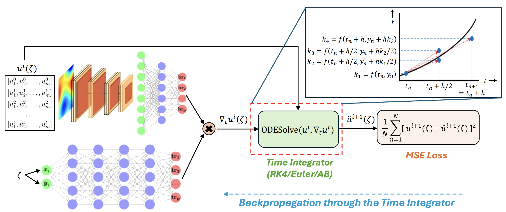

# TI-DeepONet-Learnable-Time-Integration-for-Stable-Long-Term-Extrapolation

[Dibyajyoti Nayak](https://scholar.google.com/citations?user=iAdGHHQAAAAJ&hl=en&oi=ao) and [Somdatta Goswami](https://scholar.google.com/citations?hl=en&user=GaKrpSkAAAAJ&view_op=list_works&sortby=pubdate)

You can find both the presentation slides and the recording of our presentation, outlining our approach and the results we achieved:

Slides - [TI-DeepONet_slides_updated](./Slides_TI-DeepONet_updated.pdf)

Recording - [TI-DeepONet_presentation](https://www.youtube.com/watch?v=bLLbKAq4RBA&t=4002s)

We introduce two frameworks: TI-DeepONet and TI(L)-DeepONet; frameworks that integrate neural operators with adaptive numerical time-stepping techniques to preserve the Markovian structure of dynamical systems while substantially mitigating error propagation in extended temporal forecasting. Our approach reformulates the learning objective from direct state prediction to the approximation of instantaneous time-derivative fields, which are subsequently integrated using established numerical schemes.

## Proposed Architecture


## Results
Extensive evaluation across three canonical PDE systems: (1) 1D Burgers', (2) 1D KdV, and (3) 2D Burgers', demonstrates that TI(L)-DeepONet marginally outperforms TI-DeepONet, with both methodologies significantly reducing relative $L_2$ extrapolation errors, approximately 81% compared to autoregressive implementations and 70% compared to fixed-horizon approaches. Notably, both frameworks maintain prediction stability for temporal domains extending to roughly twice the training interval. The below table summarizes the relative $L_2$ errors obtained in the extrapolation regime for different frameworks employed in this study:

<!-- | Problem        | Method             | t+10Δt          | t+20Δt          | t+40Δt          | T\*              |
|----------------|--------------------|------------------|------------------|------------------|------------------|
| **Burgers' (1D)** | TI(L)-DeepONet     | **0.019±0.003** | **0.023±0.003** | **0.036±0.004** | **0.044±0.005** |
|                | TI-DeepONet AB      | 0.031±0.004     | 0.037±0.005     | 0.057±0.008     | 0.070±0.011     |
|                | Full Rollout        | 0.043±0.002     | 0.095±0.004     | 0.247±0.028     | 0.336±0.053     |
|                | Autoregressive      | 0.710±0.089     | 1.004±0.144     | 1.556±0.206     | 1.768±0.227     |
| **KdV (1D)**     | TI(L)-DeepONet     | **0.054±0.019** | **0.065±0.027** | **0.075±0.031** | **0.111±0.051** |
|                | TI-DeepONet AB      | 0.086±0.026     | 0.108±0.034     | 0.129±0.043     | 0.183±0.063     |
|                | Full Rollout        | 0.776±0.0004    | 0.716±0.0005    | 0.719±0.0005    | 0.795±0.0007    |
|                | Autoregressive      | 0.823±0.073     | 0.886±0.064     | 0.922±0.069     | 0.968±0.083     |
| **Burgers' (2D)** | TI(L)-DeepONet     | **0.111±0.002** | **0.121±0.003** | **0.143±0.004** | **0.155±0.004** |
|                | TI-DeepONet AB      | 0.121±0.002     | 0.133±0.002     | 0.157±0.003     | 0.169±0.003     |
|                | Full Rollout        | 0.131±0.007     | 0.194±0.014     | 0.357±0.035     | 0.453±0.049     |
|                | Autoregressive      | 0.503±0.017     | 0.590±0.024     | 0.783±0.052     | 0.894±0.075     | -->


<table>
  <thead>
    <tr>
      <th>Problem</th>
      <th>Method</th>
      <th>t+10Δt</th>
      <th>t+20Δt</th>
      <th>t+40Δt</th>
      <th>T*</th>
    </tr>
  </thead>
  <tbody>
    <tr>
      <td rowspan="4"><b>Burgers' (1D)</b></td>
      <td><b>TI(L)-DeepONet</b></td>
      <td><b>0.019±0.003</b></td>
      <td><b>0.023±0.003</b></td>
      <td><b>0.036±0.004</b></td>
      <td><b>0.044±0.005</b></td>
    </tr>
    <tr>
      <td>TI-DeepONet AB</td>
      <td>0.031±0.004</td>
      <td>0.037±0.005</td>
      <td>0.057±0.008</td>
      <td>0.070±0.011</td>
    </tr>
    <tr>
      <td>Full Rollout</td>
      <td>0.043±0.002</td>
      <td>0.095±0.004</td>
      <td>0.247±0.028</td>
      <td>0.336±0.053</td>
    </tr>
    <tr>
      <td>Autoregressive</td>
      <td>0.710±0.089</td>
      <td>1.004±0.144</td>
      <td>1.556±0.206</td>
      <td>1.768±0.227</td>
    </tr>
    <tr>
      <td rowspan="4"><b>KdV (1D)</b></td>
      <td><b>TI(L)-DeepONet</b></td>
      <td><b>0.054±0.019</b></td>
      <td><b>0.065±0.027</b></td>
      <td><b>0.075±0.031</b></td>
      <td><b>0.111±0.051</b></td>
    </tr>
    <tr>
      <td>TI-DeepONet AB</td>
      <td>0.086±0.026</td>
      <td>0.108±0.034</td>
      <td>0.129±0.043</td>
      <td>0.183±0.063</td>
    </tr>
    <tr>
      <td>Full Rollout</td>
      <td>0.776±0.0004</td>
      <td>0.716±0.0005</td>
      <td>0.719±0.0005</td>
      <td>0.795±0.0007</td>
    </tr>
    <tr>
      <td>Autoregressive</td>
      <td>0.823±0.073</td>
      <td>0.886±0.064</td>
      <td>0.922±0.069</td>
      <td>0.968±0.083</td>
    </tr>
    <tr>
      <td rowspan="4"><b>Burgers' (2D)</b></td>
      <td><b>TI(L)-DeepONet</b></td>
      <td><b>0.111±0.002</b></td>
      <td><b>0.121±0.003</b></td>
      <td><b>0.143±0.004</b></td>
      <td><b>0.155±0.004</b></td>
    </tr>
    <tr>
      <td>TI-DeepONet AB</td>
      <td>0.121±0.002</td>
      <td>0.133±0.002</td>
      <td>0.157±0.003</td>
      <td>0.169±0.003</td>
    </tr>
    <tr>
      <td>Full Rollout</td>
      <td>0.131±0.007</td>
      <td>0.194±0.014</td>
      <td>0.357±0.035</td>
      <td>0.453±0.049</td>
    </tr>
    <tr>
      <td>Autoregressive</td>
      <td>0.503±0.017</td>
      <td>0.590±0.024</td>
      <td>0.783±0.052</td>
      <td>0.894±0.075</td>
    </tr>
  </tbody>
</table>


## Datasets

Link to the datasets used in this work: [TI-DeepONet_datasets](https://livejohnshopkins-my.sharepoint.com/personal/sgoswam4_jh_edu/_layouts/15/onedrive.aspx?id=%2Fpersonal%2Fsgoswam4%5Fjh%5Fedu%2FDocuments%2FCentrum%20IntelliPhysics%2FTI%2DDeepoNet&ga=1)

## Installation

The code for this project is written in JAX. To install the dependencies and get started, clone the repository and install the required packages:

```bash
git clone https://github.com/Centrum-IntelliPhysics/TI-DeepONet-for-Stable-Long-Term-Extrapolation.git
cd TI-DeepONet-for-Stable-Long-Term-Extrapolation
pip install -r requirements.txt
```

## Repository Overview

This repository contains implementations and analyses for the experiments described in the paper. There are three different directions in the codes folder. Each case has 4 different accompanying Jupyter notebbokks that implement the 4 different frameworks: (1) DeepONet Autoregressive, (2) DeepONet Full Rollout, (3) TI-DeepONet, and (4) TI(L)-DeepONet.

### Citation:
Our preprint is available on [Arxiv](https://arxiv.org/abs/2505.17341). If you use this code for your research, please cite our paper.

```bash
@article{nayak2025ti,
  title={TI-DeepONet: Learnable Time Integration for Stable Long-Term Extrapolation},
  author={Nayak, Dibyajyoti and Goswami, Somdatta},
  journal={arXiv preprint arXiv:2505.17341},
  year={2025}
}
```


