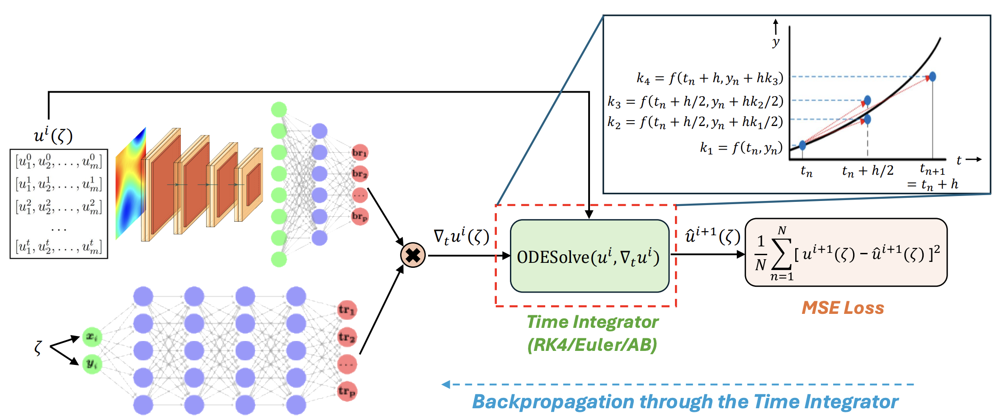

# TI-DeepONet: Learnable Time Integration for Stable Long-Term Extrapolation

[](https://opensource.org/licenses/Apache-2.0)
[](https://doi.org/10.1016/j.cma.2026.118960)
[](https://arxiv.org/abs/2505.17341)
[](https://github.com/Centrum-IntelliPhysics/TI-DeepONet-for-Stable-Long-Term-Extrapolation/releases/tag/v1.0.0)

[Dibyajyoti Nayak](https://scholar.google.com/citations?user=iAdGHHQAAAAJ&hl=en&oi=ao) and [Somdatta Goswami](https://scholar.google.com/citations?hl=en&user=GaKrpSkAAAAJ&view_op=list_works&sortby=pubdate)

We introduce **TI-DeepONet** and **TI(L)-DeepONet**: neural operator frameworks that integrate adaptive numerical time-stepping techniques to preserve the Markovian structure of dynamical systems while substantially mitigating error propagation in extended temporal forecasting. Our approach reformulates the learning objective from direct state prediction to the approximation of instantaneous time-derivative fields, which are subsequently integrated using established numerical schemes.

## Proposed Architecture



### Highlights

- **Stable long-term extrapolation**: Maintains prediction stability for temporal domains extending to ~2× the training interval
- **Significant error reduction**: ~96.3% lower relative L₂ errors compared to autoregressive implementations; ~83.6% lower than fixed-horizon approaches
- **Physics-preserving**: Preserves the Markovian structure and temporal causality of dynamical systems through time-derivative learning
- **Flexible integration**: Compatible with adaptive numerical time-stepping schemes; supports higher-precision integrators at inference than those used during training
- **Learnable integration**: TI(L)-DeepONet incorporates learnable coefficients for multi-stage numerical integration, adapting to solution-specific variations

## Paper

Our work has been published in **Computer Methods in Applied Mechanics and Engineering**.

**Title**: TI-DeepONet: Learnable time integration for stable long-term extrapolation  
**DOI**: [10.1016/j.cma.2026.118960](https://doi.org/10.1016/j.cma.2026.118960)  
**Official Article Link**: [ScienceDirect](https://www.sciencedirect.com/science/article/pii/S0045782526002331)

The preprint is also available on arXiv: [2505.17341](https://arxiv.org/abs/2505.17341)

## Results

Extensive evaluation across six canonical PDE systems spanning diverse, high-dimensional, chaotic, dissipative, and dispersive dynamics demonstrates that TI(L)-DeepONet marginally outperforms TI-DeepONet, with both methodologies significantly reducing relative L₂ extrapolation errors compared to baseline approaches.

<table>
  <thead>
    <tr>
      <th>Problem</th>
      <th>Method</th>
      <th>t+10Δt</th>
      <th>t+20Δt</th>
      <th>t+40Δt</th>
      <th>T*</th>
    </tr>
  </thead>
  <tbody>
    <tr>
      <td rowspan="4"><b>Burgers' (1D)</b></td>
      <td><b>TI(L)-DeepONet</b></td>
      <td><b>0.019±0.003</b></td>
      <td><b>0.023±0.003</b></td>
      <td><b>0.036±0.004</b></td>
      <td><b>0.044±0.005</b></td>
    </tr>
    <tr>
      <td>TI-DeepONet AB</td>
      <td>0.031±0.004</td>
      <td>0.037±0.005</td>
      <td>0.057±0.008</td>
      <td>0.070±0.011</td>
    </tr>
    <tr>
      <td>Full Rollout</td>
      <td>0.043±0.002</td>
      <td>0.095±0.004</td>
      <td>0.247±0.028</td>
      <td>0.336±0.053</td>
    </tr>
    <tr>
      <td>Autoregressive</td>
      <td>0.710±0.089</td>
      <td>1.004±0.144</td>
      <td>1.556±0.206</td>
      <td>1.768±0.227</td>
    </tr>
    <tr>
      <td rowspan="4"><b>KdV (1D)</b></td>
      <td><b>TI(L)-DeepONet</b></td>
      <td><b>0.054±0.019</b></td>
      <td><b>0.065±0.027</b></td>
      <td><b>0.075±0.031</b></td>
      <td><b>0.111±0.051</b></td>
    </tr>
    <tr>
      <td>TI-DeepONet AB</td>
      <td>0.086±0.026</td>
      <td>0.108±0.034</td>
      <td>0.129±0.043</td>
      <td>0.183±0.063</td>
    </tr>
    <tr>
      <td>Full Rollout</td>
      <td>0.776±0.0004</td>
      <td>0.716±0.0005</td>
      <td>0.719±0.0005</td>
      <td>0.795±0.0007</td>
    </tr>
    <tr>
      <td>Autoregressive</td>
      <td>0.823±0.073</td>
      <td>0.886±0.064</td>
      <td>0.922±0.069</td>
      <td>0.968±0.083</td>
    </tr>
    <tr>
      <td rowspan="4"><b>Burgers' (2D)</b></td>
      <td><b>TI(L)-DeepONet</b></td>
      <td><b>0.111±0.002</b></td>
      <td><b>0.121±0.003</b></td>
      <td><b>0.143±0.004</b></td>
      <td><b>0.155±0.004</b></td>
    </tr>
    <tr>
      <td>TI-DeepONet AB</td>
      <td>0.121±0.002</td>
      <td>0.133±0.002</td>
      <td>0.157±0.003</td>
      <td>0.169±0.003</td>
    </tr>
    <tr>
      <td>Full Rollout</td>
      <td>0.131±0.007</td>
      <td>0.194±0.014</td>
      <td>0.357±0.035</td>
      <td>0.453±0.049</td>
    </tr>
    <tr>
      <td>Autoregressive</td>
      <td>0.503±0.017</td>
      <td>0.590±0.024</td>
      <td>0.783±0.052</td>
      <td>0.894±0.075</td>
    </tr>
  </tbody>
</table>

## Installation

The code for this project is written in **JAX**. To install the dependencies and get started:

```bash
git clone https://github.com/Centrum-IntelliPhysics/TI-DeepONet-for-Stable-Long-Term-Extrapolation.git
cd TI-DeepONet-for-Stable-Long-Term-Extrapolation
pip install -r requirements.txt
```

## Datasets

The datasets used in this work are available here:  📁 [TI-DeepONet Datasets](https://livejohnshopkins-my.sharepoint.com/:f:/g/personal/sgoswam4_jh_edu/IgDaEmuDvTQ6RahT2oBinhChAdCmLGsdx9sucZaCFe2cLVg?e=qlg8MA)


## Repository Overview

This repository contains implementations for the experiments described in the paper. The `codes` folder contains six different PDE cases, each with both python scripts and Jupyter notebooks implementing the different frameworks:

| Framework | Description |
|-----------|-------------|
| **DeepONet Autoregressive** | Standard DeepONet autoregressive baseline with sequential predictions between two successive states |
| **DeepONet Full Rollout** | DeepONet Full rollout that predicts complete spatiotemporal solutions from an initial condition |
| **TI-DeepONet** | DeepONet predicts instantaneous time-derivative; time-integration with classical Adams-Bashforth/Runge-Kutta schemes |
| **TI(L)-DeepONet** | DeepONet predicts instantaneous time-derivative; time-integration with adaptive RK4 having learnable slope coefficients |
| **FNO Autoregressive** | Standard FNO autoregressive baseline with sequential predictions between two successive states |
| **FNO Full Rollout** | FNO Full rollout that predicts complete spatiotemporal solutions from an initial condition |

### Directory Structure

```
TI-DeepONet-for-Stable-Long-Term-Extrapolation/
├── codes/
│   ├── 1D_Burgers/
│   │   ├── DeepONet_Autoregressive.ipynb
│   │   ├── DeepONet_Full_Rollout.ipynb
│   │   ├── TI_DeepONet.ipynb
│   │   └── TI_L_DeepONet.ipynb
│   ├── 1D_KdV/
│   │   └── ... (similar structure)
│   ├── 1D_KS/
│   │   └── ... (similar structure)
│   └── 2D_Burgers_nu_1e-4/
│       └── ... (similar structure)
│   ├── 2D_RotationAdvection/
│   │   └── ... (similar structure)
│   ├── 3D_Heat/
│   │   └── ... (similar structure)
├── Slides_TI-DeepONet_updated.pdf
├── TI-DON.png
├── requirements.txt
├── LICENSE
└── README.md
```

## Presentation

📊 **Slides**: [TI-DeepONet_slides_updated](./Slides_TI-DeepONet_updated.pdf)  
🎥 **Recording**: [YouTube Presentation](https://www.youtube.com/watch?v=bLLbKAq4RBA&t=4002s)

## Citation

If you use this code for your research, please cite our paper:

```bibtex
@article{NAYAK2026118960,
  title = {TI-DeepONet: Learnable time integration for stable long-term extrapolation},
  journal = {Computer Methods in Applied Mechanics and Engineering},
  volume = {456},
  pages = {118960},
  year = {2026},
  issn = {0045-7825},
  doi = {https://doi.org/10.1016/j.cma.2026.118960},
  url = {https://www.sciencedirect.com/science/article/pii/S0045782526002331},
  author = {Dibyajyoti Nayak and Somdatta Goswami},
  keywords = {Operator learning, Dynamical systems, Deep operator networks, Partial differential equations, Numerical time-integration, Autoregressive, Extrapolation}
}
```

## Contributing

We welcome contributions! Please feel free to open issues or submit pull requests.

## License

This project is licensed under the Apache 2.0 License - see the [LICENSE](LICENSE) file for details.